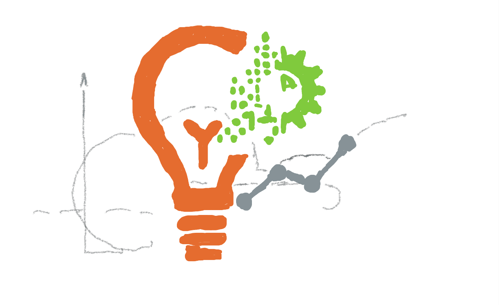

## Holacracy 

---
## Dynamic and Ever Changing Landscape In Business

---
## Inspired From Nature 

---
## An Operating System For Companies ?

---
## Why Did Zappos Choose Holacracy

---
## Organising Around Purpose

---
## Why Is It Agile

- From roles to functions, no more functions
- From delegated to diffused authority, there is no longer a boss.
- Rapid, incremental evolution rather than large reorganizations
- Responsibility clarification: explicit and transparent norms rather than politics  based on implicit expectations

---
## Why Is It Scalable

---
## Why Companies Choose Holacracy?

---
## Navigating Challenges And Oppurtunities

---
## Who Has The Power and Who Decides?

---
## Power Of Holacracy

---
## How Is Conflicts and Decisions Made

---
## What Would You Get If you Work In A Holacracy Organisation

---
## Is It Easy to Implement ?
Definitely Not , No Change Is Easy. Lot Of Hurdles But At The End Definitely 

---
## Can You Do What You Want ? 

When true self-management is happening, people understand exactly what is expected of them and then have the ability to do what they think is best to get that done

---
## Key Three Take Aways 

